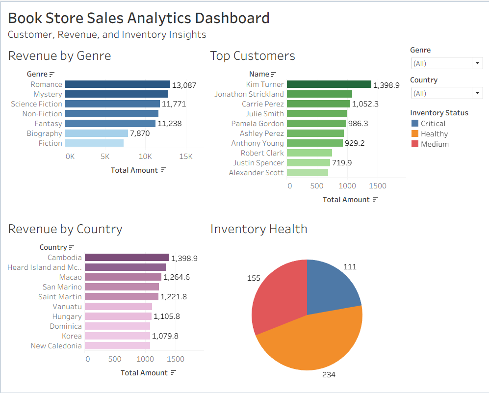

# 📚 Book Store Sales Analytics

## Project Overview

This project analyzes bookstore sales data using PostgreSQL and Tableau to uncover insights related to customer purchasing behavior, revenue generation, genre performance, and inventory management.

The project simulates real-world retail analytics use cases and demonstrates how SQL and data visualization can support business decision-making.

---

## Business Objective

Bookstores must balance inventory availability, customer demand, and revenue growth while managing hundreds of products and customers.

This project aims to:

- Identify top revenue-generating genres
- Analyze customer purchasing patterns
- Evaluate country-level sales performance
- Monitor inventory health
- Support data-driven sales and inventory decisions

---

## Dataset

The analysis is based on three relational datasets:

### Books
- Book ID
- Title
- Author
- Genre
- Price
- Stock
- Published Year

### Customers
- Customer ID
- Name
- Email
- Country
- City

### Orders
- Order ID
- Customer ID
- Book ID
- Quantity
- Order Date
- Total Amount

---

## Tools Used

- PostgreSQL
- SQL
- Tableau Public
- GitHub

---

## Data Model

The project uses a relational schema consisting of:

```text
Customers
    │
    └── Customer ID
             │
             ▼
          Orders
             ▲
             │
       Book ID
             │
             ▼
          Books
```

---

## SQL Analysis Performed

### Revenue Analysis

- Revenue by Genre
- Revenue by Country
- Monthly Revenue Trends
- Revenue Contribution Analysis

### Customer Analysis

- Top Customers by Revenue
- Customer Segmentation
- Customer Spending Analysis

### Inventory Analysis

- Inventory Health Assessment
- Low Stock Identification
- Inventory Risk Categorization

### Advanced SQL Analysis

- Common Table Expressions (CTEs)
- Window Functions
- Ranking Analysis
- Running Totals
- Subqueries
- Customer Segmentation Logic

---

## Dashboard

The Tableau dashboard provides a visual overview of:

- Revenue by Genre
- Top Customers
- Revenue by Country
- Inventory Health



### Interactive Dashboard

View the live Tableau dashboard:

[PASTE_TABLEAU_PUBLIC_LINK_HERE](https://public.tableau.com/views/BookStoreSalesAnalyticsDashboard/Dashboard1?:language=en-GB&:sid=&:redirect=auth&:display_count=n&:origin=viz_share_link)

---

## Key Insights

- Romance and Mystery genres generated the highest revenue.
- Revenue was concentrated among a small group of high-value customers.
- Certain countries contributed disproportionately to overall sales.
- Inventory analysis identified books at risk of stock depletion.
- Customer purchase behavior revealed opportunities for targeted marketing.

---

## SQL Concepts Demonstrated

- INNER JOIN
- LEFT JOIN
- Common Table Expressions (CTEs)
- Subqueries
- CASE Statements
- Aggregate Functions
- Window Functions
- ROW_NUMBER()
- RANK()
- DENSE_RANK()
- Running Totals
- Customer Segmentation

---

## Repository Structure

```text
bookstore-sales-analytics-sql-tableau
│
├── data
│   ├── Books.csv
│   ├── Customers.csv
│   └── Orders.csv
│
├── sql
│   └── bookstore_sales_analysis.sql
│
├── screenshots
│   └── dashboard.png
│
├── dashboard
│   └── tableau_public_link.md
│
└── README.md
```

---

## Author

Abhishek Bhuniya

Business Analyst
